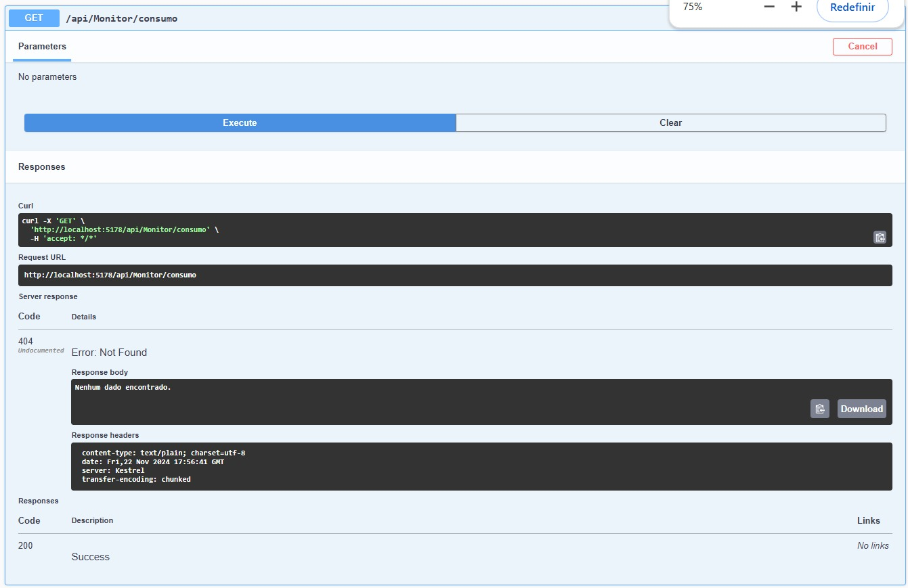

# Integrantes

- João Pedro Moura Tuneli **RM:93530**

- Enzo Massayuki Obayashi **RM:95634**

## Evidencias de Funcionamento

### Evidencias de erro(404,401)

- **GET**

- **POST**

### Requisições funcionando

- **GET**

- **POST**

- **Serviço Operacional**(Health)

----

# Integração com MongoDB

# Requisição Sem e com Redis , para teste de desenpenho:

## Sem Redis

- **1° Requisição(13ms)**

- **2° Requisição(29ms)**

- **3° Requisição(9ms)**

## Com Redis

- **1° Requisição(18ms)**

- **2° Requisição(26ms)**

- **3° Requisição(9ms)**

## Comparação de Desempenho: Com Redis x Sem Redis

| Condição      | Requisição 1 (ms) | Requisição 2 (ms) | Requisição 3 (ms) | Tempo Médio (ms) |
|---------------|-------------------|-------------------|-------------------|------------------|
| **Sem Redis** | 13                | 29                | 9                 | 17               |
| **Com Redis** | 18                | 26                | 9                 | 17.67            |

----

# Testes com XUnit:

## Testes realizados:

- [ ] Inserção de dados no MongoDB
- [ ] Recuperação de dados do cache Redis
- [ ] Respostas corretas de Status Codes
- [ ] Cenário de erro ao consultar MongoDB
- [ ] Cenário de erro ao acessar o Redis

## Resultado:

